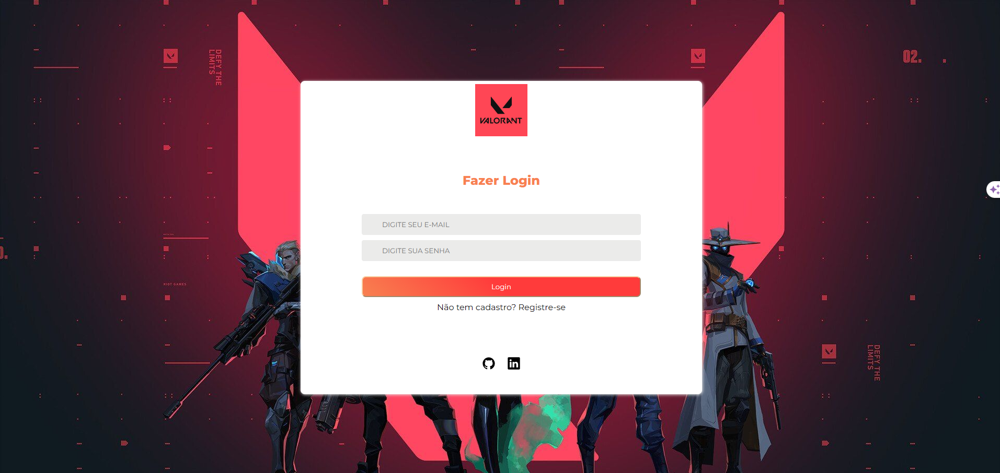

# Tela de Login e Cadastro

## 📄 Descrição

Este projeto foi desenvolvido em React, trabalhando com a renderização condicional de tela. O usuário terá condições de criar seu cadastro a partir da tela de login, inserindo seus dados.

[Clique aqui para acessar](https://tela-de-login-e-cadastro.vercel.app/)

## ⚒️ Tecnologias 

## 📫 Contato

E-mail: emidio.daniel@hotmail.com

